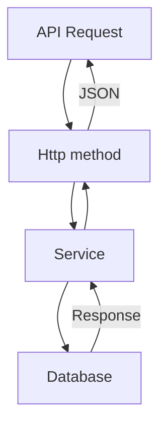

# COCCOC_TEST

## TASKS

- https://github.com/AleksGerman/coccoc-php-assignment

## USED LIBS

- [AltoRouter](https://altorouter.com)
    - HTTP methods
    - Dynamic routing with (named) route parameters
    - Flexible regular expression routing, inspired by Sinatra
    - Reversed routing
    - Custom regexes

## USAGE

### Connect to database
- Configuration 
    ```php
    <?php

    class DB
    {
        protected $db;
        protected $dbHost = "127.0.0.1";
        protected $dbName = "coccoc_test";
        protected $dbUser = "root";
        protected $dbPass = "";
        protected $tableName;

        public function __construct()
        {
            try {
                $this->db = new PDO("mysql:host=$this->dbHost;dbname=$this->dbName",$this->dbUser, $this->dbPass);
                $this->db->setAttribute(PDO::ATTR_ERRMODE, PDO::ERRMODE_EXCEPTION);

            } catch (Exception $exception) {
                echo "Connection failed";
                echo $exception->getMessage();
                $this->db = null;
            }
        }

        /**
        * @param mixed $tableName
        */
        public function setTableName($tableName)
        {
            $this->tableName = $tableName;
        }
    }
    ```

### Add a new endpoint API

- Add endpoint in `index.php`.

    ```php
    $router->map('GET','/advert/get-list','Advert#getAll','getAll');
    ```

- Add service at `api` directory.

    ```php
    <?php

    require_once dirname(__DIR__, 1) . '/db/DB.php';

    class Advert extends DB
    {
        // Add service methods.
    }
    
- Render JSON in method

    ```php
    echo json_encode([
        "code" => 200,
        "data" => $data
    ]);
    ```

## RESPONSE API 

- Method for getting list of ads `http://localhost:8000/advert/get-list?page=1&sort=ads.created_at,desc&and=ads.price,desc`
    ```php
    {
        "code": 200,
        "data": [
            {
                "title": "education",
                "price": "5000000.00",
                "link": "https://images.pexels.com/photos/674010/pexels-photo-674010.jpeg?auto=compress&cs=tinysrgb&dpr=1&w=500"
            },
            {
                "title": "finance",
                "price": "200000.00",
                "link": "https://cdn.pixabay.com/photo/2015/04/23/22/00/tree-736885__480.jpg"
            },
            {
                "title": "sport",
                "price": "100000.00",
                "link": "https://thumbs.dreamstime.com/b/environment-earth-day-hands-trees-growing-seedlings-bokeh-green-background-female-hand-holding-tree-nature-field-gra-130247647.jpg"
            }
        ]
    }
    ```
- Method of getting a specific ads `http://localhost:8000/advert/{id}`

    ```php
    {
        "code": 200,
        "data": [
            {
                "title": "education",
                "price": "5000000.00",
                "link": "https://images.pexels.com/photos/674010/pexels-photo-674010.jpeg?auto=compress&cs=tinysrgb&dpr=1&w=500",
                "description": null
            },
            {
                "title": "education",
                "price": "5000000.00",
                "link": "https://images.unsplash.com/photo-1575936123452-b67c3203c357?ixlib=rb-4.0.3&ixid=MnwxMjA3fDB8MHxzZWFyY2h8Mnx8aW1hZ2V8ZW58MHx8MHx8&w=1000&q=80",
                "description": null
            }
        ]
    }
    ```

- Ads creation method (POST Method) `http://localhost:8000/advert/create`
    - body
        ```php
        {
            "title": "education",
            "price": 100000,
            "link": {
                "0" : "https://i0.wp.com/www.flutterbeads.com/wp-content/uploads/2022/01/add-image-in-flutter-hero.png?fit=2850%2C1801&ssl=1",
                "1" : "https://d38b044pevnwc9.cloudfront.net/cutout-nuxt/enhancer/2.jpg",
                "2" : "https://www.industrialempathy.com/img/remote/ZiClJf-1920w.jpg"
            },
            "description": {
                "0" : "test",
                "1" : "test",
                "2" : "test"
            }
        }
        ```

    - response
        ```php
        {
            "code": 200,
            "data": "17"
        }
        ```

### DIAGRAM 


### UNIT TESTS 

- Installation phpunit
- `composer require --dev phpunit/phpunit ^6`

- The XML Configuration File in `phpunit.xml`.
    ```xml
    <?xml version="1.0" encoding="UTF-8"?>
    <phpunit colors="true" bootstrap="vendor/autoload.php">
        <testsuites>
            <testsuite name="Application Test Suite">
                <directory>./tests/</directory>
            </testsuite>
        </testsuites>
    </phpunit>
    ```

- Write test case in `tests/advertTest.php`.
    ```php
    <?php
    require_once dirname(__DIR__, 1) . '/api/advert.php';

    use PHPUnit\Framework\TestCase;

    class AdvertTest extends TestCase
    {
        private $ads;

        public function setUp()
        {
            parent::setUp();

            $this->ads = new Advert();
        }

        /**
        * @test
        */
        public function testGetAll()
        {
            $res = file_get_contents('http://localhost:8010/advert/get-list');
            $data = json_decode($res, true);

            //test http status
            $this->assertEquals(200, $data['code']);

            //test key data response
            $this->assertArrayHasKey('data', $data);
            
            //test data response exist title field or not
            $this->assertArrayHasKey('title', $data['data'][0]);

            //test data response exist link field or not
            $this->assertArrayHasKey('link', $data['data'][0]);

            //test data response exist price field or not
            $this->assertArrayHasKey('price', $data['data'][0]);
        }
    }
    ```

## COMMAND

- `php -S localhost:8000`
